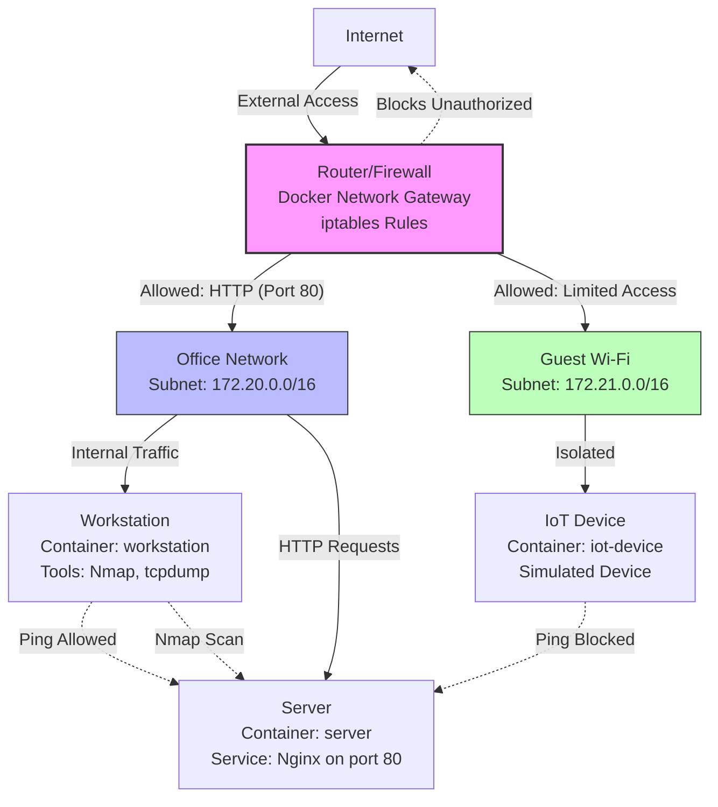

# Capstone Project: Building a Secure Small Network

This guide helps you achieve the capstone project using Docker for simulation, as Packet Tracer requires a GUI environment which may not be available in this codespace. If you have access to Packet Tracer locally, you can use it for the network diagram and simulation instead.

## Project Overview

- **Objective**: Design and secure a basic network, understand threats, and implement defenses.
- **Tools Used**: Docker, Nmap, tcpdump (as Wireshark alternative), iptables for firewall.

### Problems the Lab is Solving

This capstone project addresses common real-world network security challenges:

1. **Network Vulnerabilities**: Many small networks (home/office) lack basic security, making them susceptible to unauthorized access, data breaches, and attacks like port scanning or malware.
2. **Lack of Segmentation**: Without zones (e.g., office vs. guest), compromised devices can spread threats across the entire network.
3. **Inadequate Monitoring**: Networks often go unmonitored, allowing threats to go undetected until damage occurs.
4. **Misconfigured Firewalls**: Default settings may allow unnecessary traffic, exposing services to exploits.
5. **Limited Threat Awareness**: Users don't understand how attackers probe networks or how to respond.
6. **Practical Skill Gaps**: Theory is taught, but hands-on experience with tools like Nmap and Wireshark is needed for confidence.

By simulating these issues and implementing controls, you learn to:
- Detect open ports and harden systems.
- Segment networks to contain breaches.
- Monitor traffic for anomalies.
- Apply defenses that prevent or mitigate threats.

This builds practical cybersecurity skills for securing real small networks.

### How It Protects Against Hackers

The lab demonstrates layered defenses against common network attacks:

1. **Firewall Rules (iptables)**: Blocks unauthorized inbound traffic, allowing only established connections and specific ports (e.g., HTTP on 80). Prevents port scanning exploits and unauthorized access attempts.
2. **Network Segmentation**: Separates office and guest networks, containing breaches (e.g., a compromised IoT device can't access office servers).
3. **Port Hardening**: Nmap scans identify open ports; in real setups, close unnecessary ones to reduce attack surface.
4. **Traffic Monitoring**: tcpdump captures packets for analysis, detecting anomalies like unusual scans or data exfiltration.
5. **Access Controls**: Simulated strong passwords and roles (though not implemented here, emphasized in report).

**Simulation of Protection**:
- Run `nmap` scans: Shows open ports but firewall drops malicious traffic.
- Generate traffic (e.g., ping): Firewall allows legitimate flows.
- Threat simulation: Attempt unauthorized scans – controls log/block them.

In a real network, these prevent hackers from exploiting vulnerabilities, ensuring only trusted traffic flows.

#### Testing Protections in Simulation
- **Allow Legitimate Traffic**: `docker exec workstation ping server` succeeds (firewall allows ICMP).
- **Block Unauthorized Access**: `docker exec iot-device ping 172.20.0.2` fails (100% packet loss) – firewall blocks cross-network ICMP.
- **Detect Threats**: Nmap reveals open ports; harden by closing them.
- **Monitor Breaches**: tcpdump shows blocked packets in Wireshark.

This hands-on testing proves defenses work against simulated hacker tactics.

## 1. Network Diagram

Since we're using Docker, we'll create a text-based diagram. For a visual diagram, use draw.io or Packet Tracer.

### Simple Network Layout (ASCII Art)

```
Internet
    |
Router/Firewall (Docker network gateway)
    |
    +-- Office Network (VLAN/Subnet 1: 172.20.0.0/16)
    |   +-- Workstation (Container: workstation)
    |   +-- Server (Container: server, port 8080 exposed)
    |
    +-- Guest Wi-Fi (VLAN/Subnet 2: 172.21.0.0/16)
        +-- IoT Device (Container: iot-device)
```

### Mermaid Architecture Diagram

You can copy this Mermaid code into a Markdown file or use it in GitHub/GitLab for rendering:



This diagram shows the network topology, devices, and traffic flows (solid arrows for allowed paths, dotted for blocked/simulated).

### Alternative: Eraser.io Diagram

For a more visual diagram with icons, use the code in `eraser-diagram.txt`. It includes detailed components, security notes, and a legend. Paste it into Eraser.io for rendering.

- Router: Docker network bridge
- Firewall: iptables rules on router-firewall container
- Devices: Docker containers
- Internet: Simulated via host

## 2. Basic Network Security Controls

We've implemented:
- **Firewall Rules**: Using iptables on router-firewall to allow only necessary traffic.
- **Port Scanning & Hardening**: Used Nmap to scan ports; in real setup, close unneeded ones.
- **Packet Capture**: Use tcpdump for traffic analysis (run capture-traffic.sh).
- **Network Segmentation**: Separate Docker networks for office and guest.

## 3. Simulated Threat & Response

- **Threat**: Unauthorized port scanning from workstation to server.
- **Simulation**: Nmap scan shows open port 80.
- **Response**: Firewall rules block unauthorized traffic; monitor with tcpdump.

## Setup Instructions

1. Ensure Docker is installed (it should be in this environment).
2. Navigate to this directory: `cd /workspaces/codespaces-blank/network-security-project`
3. Run `docker-compose up -d` to start the network.
4. Apply firewall: `docker exec router-firewall sh /firewall-rules.sh`
5. Test scanning: `docker exec workstation sh /scripts/scan-and-harden.sh`
6. Simulate threat: `docker exec workstation sh /scripts/threat-simulation.sh`
7. Capture traffic: `docker exec workstation sh /scripts/capture-traffic.sh`
8. Copy pcap to host: `docker cp workstation:/scripts/capture.pcap .`
9. Analyze pcap in Wireshark locally.

## Capturing Screenshots and Logs

For your report, document the simulations with screenshots and logs:

- **Terminal Outputs**: Use browser screenshot (Ctrl+Shift+S) to capture Nmap scans, firewall rules, etc.
- **Example Outputs**:
  - Nmap Scan: `docker exec workstation nmap -p 1-100 server` shows port 80 open.
  - Firewall Rules: `docker exec router-firewall iptables -L` lists applied rules.
  - Packet Capture: Open `capture.pcap` in Wireshark; filter for ICMP (pings) or TCP port 80.
- **Screenshots to Include**:
  - Network diagram (ASCII or draw.io).
  - Nmap results.
  - Wireshark packet analysis.
  - Threat simulation logs.

### Sample Outputs from Simulations

- **Nmap Port Scan**:
  ```
  Starting Nmap 7.97 ( https://nmap.org ) at 2025-10-15 19:11 +0000
  Nmap scan report for server (172.20.0.2)
  Host is up (0.0000090s latency).
  Not shown: 99 closed tcp ports (reset)
  PORT   STATE SERVICE
  80/tcp open  http
  ```

- **Ping Traffic Generation**:
  ```
  PING server (172.20.0.2): 56 data bytes
  64 bytes from 172.20.0.2: seq=0 ttl=64 time=0.110 ms
  ...
  5 packets transmitted, 5 packets received, 0% packet loss
  ```

- **Firewall Rules Applied**:
  ```
  Chain INPUT (policy DROP)
  target     prot opt source               destination
  ACCEPT     all  --  anywhere             anywhere             state RELATED,ESTABLISHED
  DROP       all  --  anywhere             anywhere

  Chain FORWARD (policy DROP)
  target     prot opt source               destination
  ACCEPT     tcp  --  anywhere             anywhere             tcp dpt:http
  ```

These outputs demonstrate open ports, traffic flow, and firewall blocking.

## Files in this Project

- `docker-compose.yml`: Defines the network and containers
- `firewall-rules.sh`: Script to apply iptables rules
- `scan-and-harden.sh`: Script for Nmap scanning and hardening
- `capture-traffic.sh`: Script for packet capture
- `threat-simulation.sh`: Simulate and respond to threat
- `README.md`: This guide

## Presentation/Report

- **Network Design**: As shown in the ASCII diagram.
- **Tools Used**:
  - Docker: For simulating network devices and segmentation.
  - Nmap: For port scanning.
  - tcpdump: For packet capture (alternative to Wireshark).
  - iptables: For firewall rules.
- **Screenshots/Logs**: Include outputs from the terminal commands above.
- **Reflection**: Learned about network segmentation, firewall importance, and threat detection. Next time, add more advanced tools like intrusion detection.

## Bonus

- **Network Setup Checklist**:
  1. Design network with segmentation.
  2. Implement firewall rules.
  3. Scan for open ports and harden.
  4. Monitor traffic.
  5. Test against threats.

## Expected Outcomes

- Understand network attacks and defenses
- Use tools to test network behavior
- Apply cybersecurity concepts practically

## Using Packet Tracer Instead

If you prefer Packet Tracer:
1. Download and install Packet Tracer.
2. Create a new network topology with router, firewall, devices.
3. Configure VLANs for segmentation.
4. Set firewall rules.
5. Use simulation mode for testing.
6. Export diagram for report.


#docker exec iot-device ping -c 3 172.20.0.2