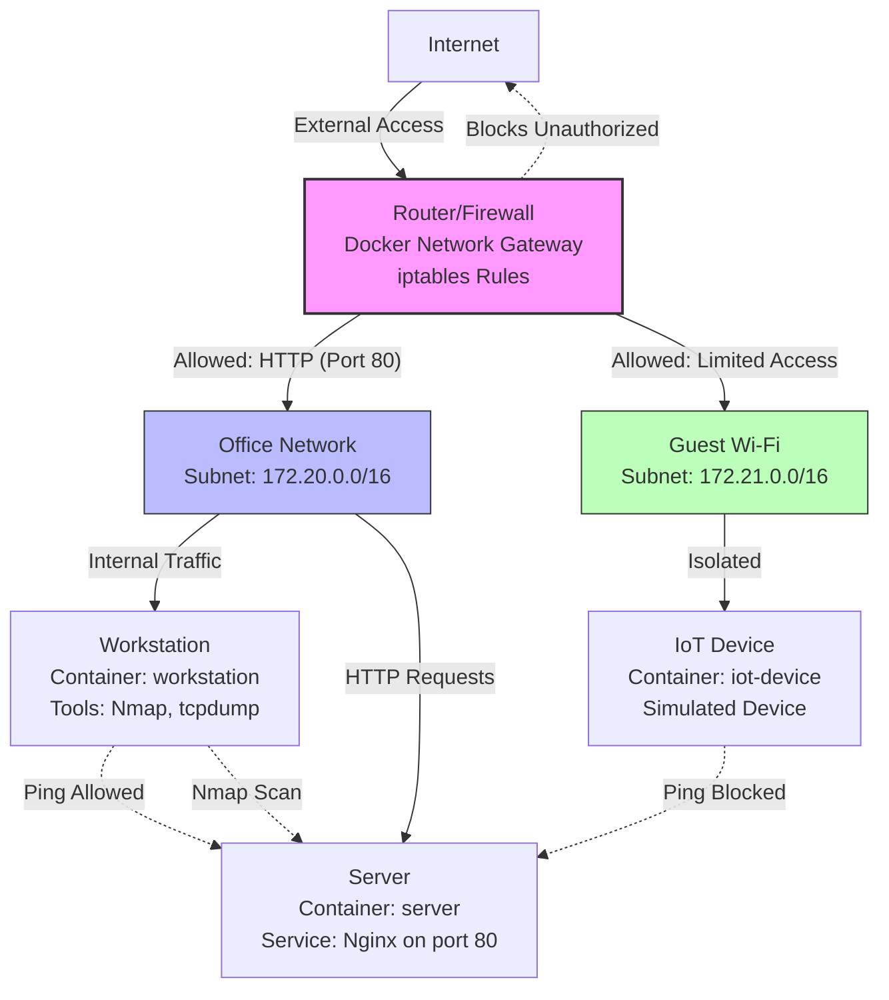

# Network Architecture Diagram

## Explanation
- **Internet**: External connection (simulated).
- **Router/Firewall**: Acts as gateway with iptables rules for security.
- **Office Network**: Segmented subnet for trusted devices; allows internal traffic and HTTP.
- **Guest Wi-Fi**: Isolated subnet for less trusted devices; limited cross-network access.
- **Traffic Flows**:
  - Solid arrows: Allowed paths (e.g., HTTP from internet to server).
  - Dotted arrows: Blocked or simulated interactions (e.g., ping from IoT to server is blocked).
- **Devices**: Containers simulating real network components.

This diagram can be rendered in Markdown viewers like GitHub or VS Code with Mermaid extension.